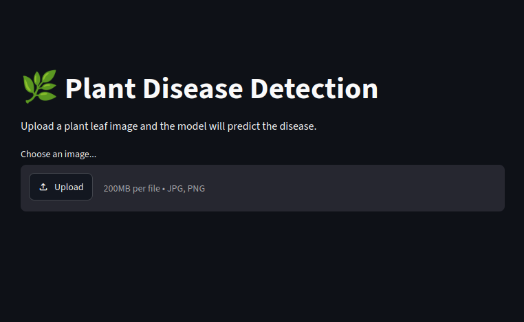
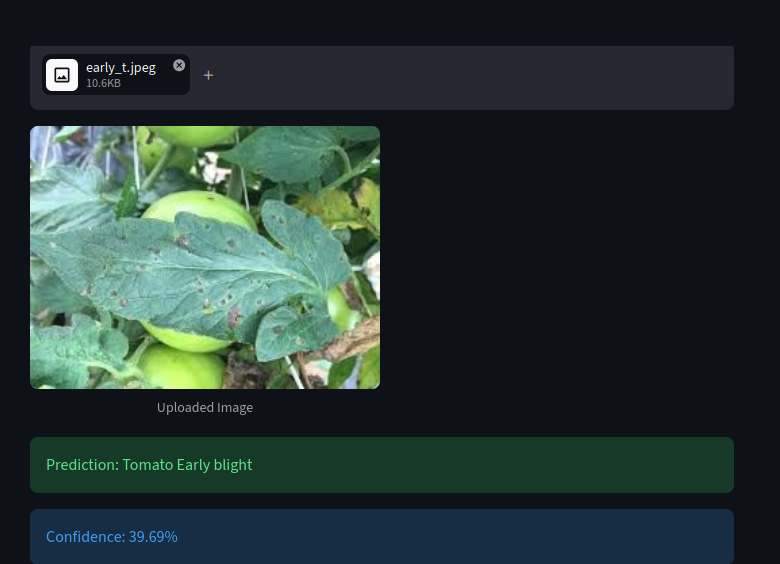
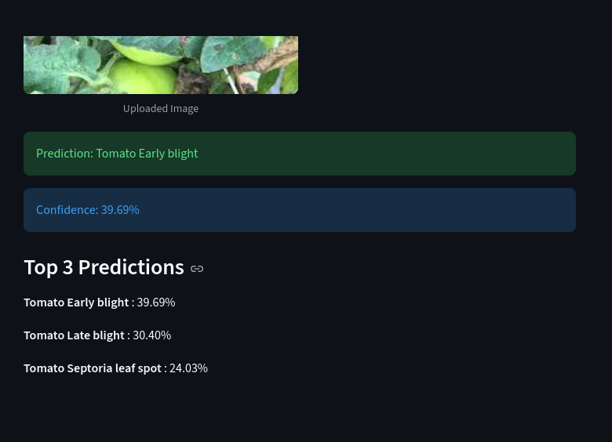

# 🌿 Plant Disease Detection

A Deep Learning-based web application that detects plant diseases from leaf images using Transfer Learning with MobileNetV2.

The application allows users to upload an image of a plant leaf and receive an instant prediction of the plant's health condition or disease class.

---

## 📌 Project Overview

This project uses a pre-trained MobileNetV2 model as a feature extractor and adds custom classification layers to identify plant diseases from leaf images.

The model was trained on the PlantVillage dataset and can classify 15 different plant health conditions across Tomato, Potato, and Pepper plants.

---

## 📂 Dataset

Dataset: PlantVillage Dataset

The dataset contains labeled images of healthy and diseased plant leaves.

---

## 🚀 Features

- Upload plant leaf images through a Streamlit web interface
- Detects 15 plant disease classes
- Transfer Learning using MobileNetV2
- Displays prediction confidence score
- Shows Top 3 predictions with probabilities
- Fast and lightweight inference

---

## 📸 Application Preview

### Home Page



### Disease Prediction



### Top 3 Predictions




## 🛠 Technologies Used

- Python
- TensorFlow / Keras
- MobileNetV2
- Streamlit
- NumPy
- Pillow (PIL)
- Scikit-learn

---

## 🧠 Model Architecture

- MobileNetV2 (ImageNet Pretrained)
- GlobalAveragePooling2D
- Dense Layer (128 neurons, ReLU)
- Dropout (0.3)
- Dense Output Layer (15 classes, Softmax)

Transfer Learning was used by freezing the MobileNetV2 base model and training only the custom classification layers.

---

## 📊 Model Performance

- Validation Accuracy: ~93%
- Number of Classes: 15

Evaluation was performed using:
- Accuracy
- Confusion Matrix
- Precision
- Recall
- F1 Score

---

## 📋 Disease Classes

### Pepper
- Pepper Bell Bacterial Spot
- Pepper Bell Healthy

### Potato
- Potato Early Blight
- Potato Late Blight
- Potato Healthy

### Tomato
- Tomato Bacterial Spot
- Tomato Early Blight
- Tomato Late Blight
- Tomato Leaf Mold
- Tomato Septoria Leaf Spot
- Tomato Spider Mites
- Tomato Target Spot
- Tomato Yellow Leaf Curl Virus
- Tomato Mosaic Virus
- Tomato Healthy

---

## 📁 Project Structure

```text
plant-disease-detection/
│
├── app.py
├── plant_weights.weights.h5
├── requirements.txt
├── README.md
├── PlantDiseaseDetection.ipynb
│
└── images/
    ├── home_page.png
    ├── prediction.png
    └── top_3_predictions.png
```

---

## ▶️ How to Run Locally

### 1. Clone the Repository

```bash
git clone https://github.com/SwathiAdireddy/plant-disease-detection.git
cd plant-disease-detection
```

### 2. Install Dependencies

```bash
pip install -r requirements.txt
```

### 3. Run the Streamlit App

```bash
streamlit run app.py
```

### 4. Open in Browser

Streamlit will provide a local URL similar to:

```text
http://localhost:8501
```

Open the URL in your browser and upload a leaf image for prediction.

---

## ⚠️ Notes

- For best results, upload clear images of a single leaf.
- Images should be well-lit and in focus.
- Predictions may vary for images significantly different from the training dataset.

---

## 👩‍💻 Author

**Swathi**

Deep Learning and Computer Vision Project using TensorFlow, Keras, MobileNetV2, and Streamlit.
